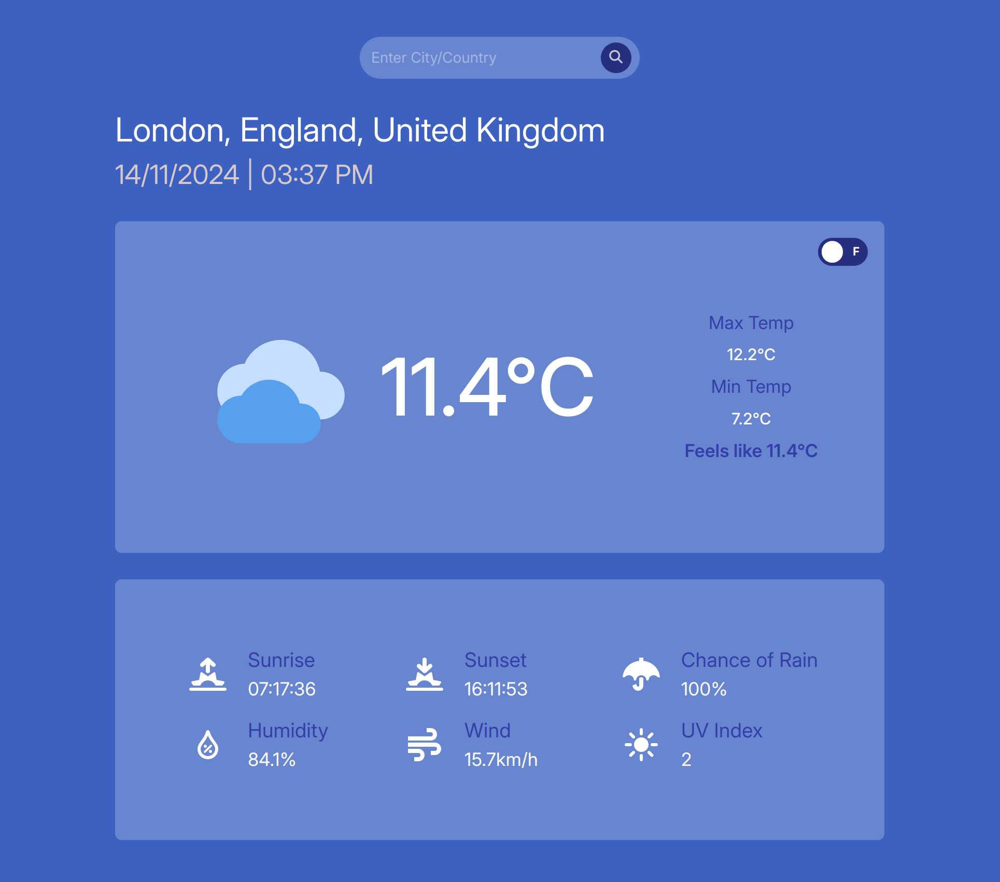

# Webpack CSS/HTML/JS Weather App

Welcome to my CSS, JavaScript, and HTML project, created as part of [The Odin Project](https://www.theodinproject.com/) curriculum! This project demonstrates foundational skills in web development, focusing on the use of Webpack for bundling, a custom autocomplete search box, and best practices with ESLint and Prettier for clean code.

## Table of Contents
- [Overview](#overview)
- [Features](#features)
- [Technologies](#technologies)

## Overview

This project is a single-page web application that features a search bar with autocomplete suggestions. The purpose of this project is to explore the use of Webpack for module bundling, along with applying essential HTML, CSS, and JavaScript skills. As part of the learning process, ESLint and Prettier are configured to enforce code quality and formatting standards.

## Features

- **Autocomplete Search Box**: An intuitive search feature that suggests relevant terms as the user types.
- **Modularized Code with Webpack**: All assets are bundled with Webpack for an organized and efficient development setup.
- **Code Linting and Formatting**: ESLint and Prettier help maintain code consistency and readability.

## Technologies

This project uses the following technologies:

- **HTML**: For structuring the content.
- **CSS**: For styling and layout.
- **JavaScript**: For implementing interactivity and the autocomplete functionality.
- **Webpack**: For bundling resources and assets.
- **ESLint** and **Prettier**: For maintaining code quality.
- **date-fns**: A JavaScript library for handling dates, useful for formatting any date-based content.

### Project Dependencies

#### Development Dependencies
- `@eslint/js` - ESLint JavaScript linter.
- `css-loader` - CSS file handling within JavaScript.
- `eslint`, `eslint-config-prettier`, `eslint-plugin-prettier` - Code quality tools.
- `globals` - Provides support for global variables.
- `html-loader` - Handles HTML imports.
- `html-webpack-plugin` - Generates an HTML file and injects bundles.
- `prettier` - Code formatting tool.
- `style-loader` - Injects CSS into the DOM.
- `webpack`, `webpack-cli`, `webpack-dev-server`, `webpack-merge` - Core Webpack utilities for building, serving, and merging configurations.

#### Main Dependency
- `date-fns` - Utility library for handling date operations.
